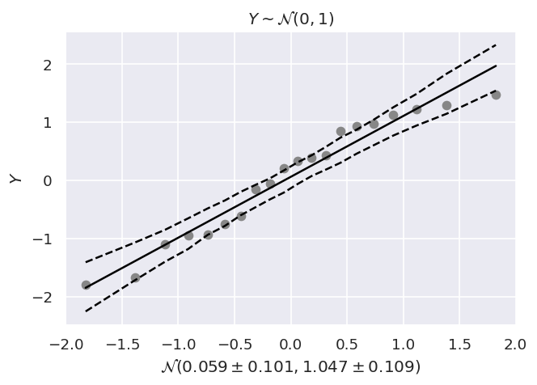
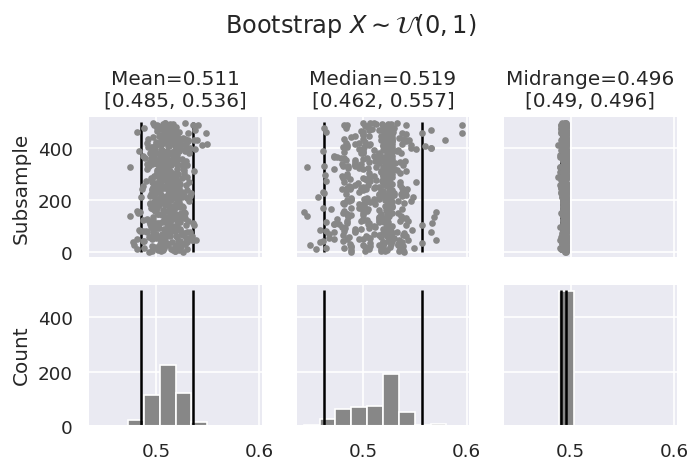

# Exploratory Data Analysis

A little collection of python implementations of the plots shown in [Exploratory Data Analysis -  Engineering Statistics Handbook](https://www.itl.nist.gov/div898/handbook/eda/eda.htm).
The notebooks in the `notebooks/` show some of the plots with example data.

My favorite ones are listed below.

## Normal probability plot

> The normal probability plot (Chambers et al., 1983) is a graphical technique for assessing whether or not a data set is approximately normally distributed.
>
> The data are plotted against a theoretical normal distribution in such a way that the points should form an approximate straight line. Departures from this straight line indicate departures from normality.
>
-- [Engineering Statistics Handbook, Normal Probability Plot](https://www.itl.nist.gov/div898/handbook/eda/section3/normprpl.htm)

|  |
|:--:|
| _A line plot showing normally distributed samples and their linear with with confidence interval._ |

My favorite part about this plot are the confidence intervals. Typically they are shown  as straight lines.
In praxis, however, this is most often not correct.

For a linear fit `y = ax + b`, we must estimate the slope `a` and the intercept `b`.
As such, we have two degrees of freedom, and the confidence intervals must reflect that.
Straight confidence intervals imply that we only estimate the intercept `b` and that the slope `a` is known from data.
In most practical applications this is not the case!

## Bootstrap plot

> The bootstrap (Efron and Gong) plot is used to estimate the uncertainty of a statistic.
>
-- [Engineering Statistics Handbook, Bootstrap Plot](https://www.itl.nist.gov/div898/handbook/eda/section3/eda334.htm)

When estimating the mean or any other quantity from samples, one should check how robust the estimation is.
For example, the Cauchy distribution does not have a mean.
As such, the estimation of the mean has a very high uncertainty, compared to, e.g., the median that does exist.

The bootstrap plot addresses this issue by not only estimating the quantity but also bootstraping confidence intervals.
|  |
|:--:|
| _A combined plot showing estimated mean, median and midrange of a uniform distribution with bootstraped confidence intervals._ |

For example, the above figure shows the estimated mean, median and midrange (i.e., max - min) of a uniform distribution over the interval [0, 1].
In this case, the midrange is the most robust statistical measure.
For other distributions or real world data, this will of course be different.

## About confidence intervals

Confidence intervals are tricky as we have seen in the normal probability plot.
In praxis, one often does not know mean and standard deviation of the measured data and both must be estimated empirically.

Assuming normally distributed data (as is standard; can be verified with the normal probability plot), we must use the *student-t distribution* to compute the confidence intervals, and not a normal distribution.
```python
c95 = np.abs(scipy.stats.t.ppf(0.05 / 2, n - 2))
c99 = np.abs(scipy.stats.t.ppf(0.01 / 2, n - 2))
```
Roughly speaking, a student-t distribution is a normal distribution where we estimate both mean and standard deviation from data.
